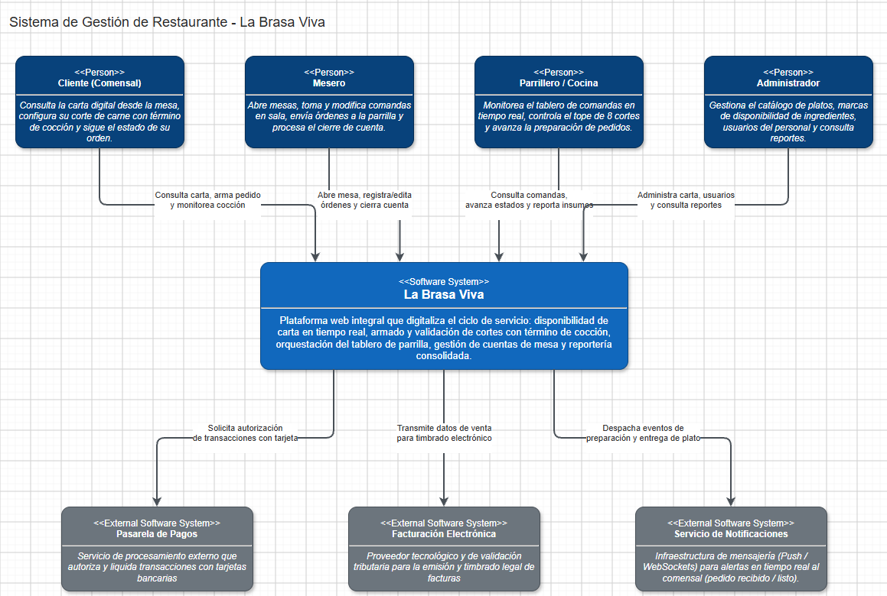
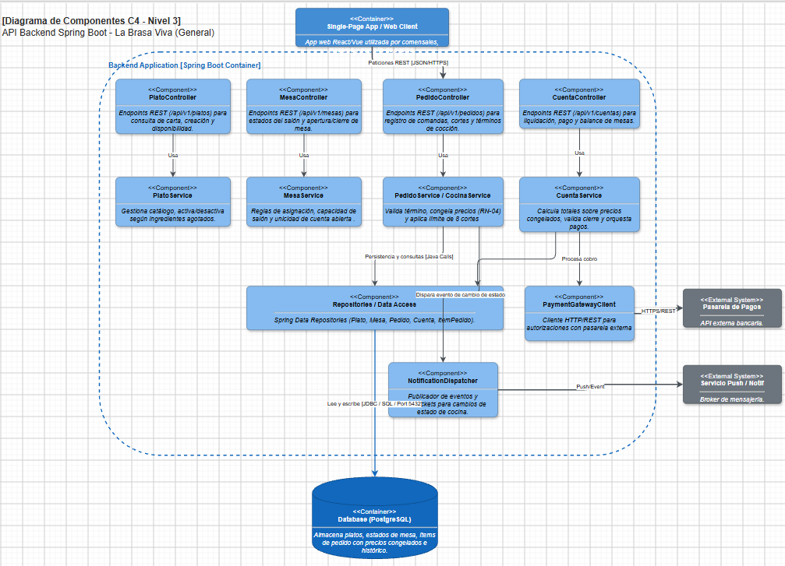
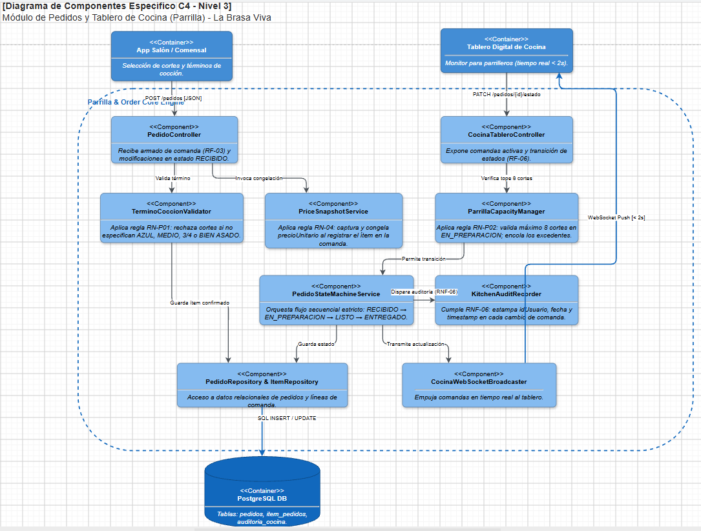

# Bitacora Corte 2 - Carlos Sanchez

## Restaurante: La Brasa Viva
Plataforma de gestion y API REST para restaurante tipo parrilla.

## Diagramas C4

### Diagrama de Contexto

### Diagrama de Componentes (General)

### Diagrama de Componentes (Especifico)

---

## Descripcion General del Proyecto
Durante este proceso se desarrollo una API REST integral para el restaurante La Brasa Viva, orientada a la gestion de operaciones diarias como el catalogo de platos, la recepcion y seguimiento de pedidos en cocina, la administracion de cuentas por mesa, el sistema de reservas y el control de vehiculos en el parqueadero.

El diseno se estructuro bajo una arquitectura por capas desacoplada y limpia, apoyandose en buenas practicas de desarrollo en el ecosistema Spring Boot.

## Arquitectura y Componentes del Sistema

El backend fue organizado en distintas capas de responsabilidad:

- Capa de Controladores (Controller): Expone los endpoints REST para cada entidad, gestiona las solicitudes HTTP, aplica la validacion automatica de entrada y retorna las respuestas con los codigos de estado apropiados.
- Capa de Servicios (Service e Impl): Contiene la logica de negocio, aplica las reglas y politicas del restaurante, orquesta llamadas a repositorios y lanza excepciones de negocio cuando una condicion no se cumple.
- Capa de Persistencia y Modelos (Domain y Repository): Define las entidades del dominio y los repositorios para almacenamiento y consulta de datos.
- Capa de Transferencia (DTOs): Separa las estructuras internas de base de datos de las estructuras expuestas a los clientes, protegiendo la integridad del modelo.
- Mapeadores (MapStruct): Realizan la transformacion limpia y eficiente entre entidades de dominio y objetos DTO sin requerir mapeo manual.

## Tecnologias Empleadas

- Java 21
- Spring Boot (Spring Web, Spring Validation)
- Lombok para reduccion de codigo repetitivo
- MapStruct para conversion entre modelos y DTOs
- SLF4J para registro de eventos y trazabilidad
- JUnit 5 y Mockito para pruebas unitarias de la logica de negocio
- Maven como gestor de construccion y dependencias

## Modulos y Funcionalidades Desarrolladas

### 1. Gestion de Platos
- Catalogo de platos con atributos como nombre, categoria, precio y disponibilidad.
- Validacion para evitar registrar platos con nombres duplicados.
- Validacion de precios positivos.
- Consultas para filtrar platos por disponibilidad y categoria.
- Cambio de estado de disponibilidad (activar o pausar platos).

### 2. Gestion de Pedidos
- Registro de pedidos asociados a una mesa con multiples items.
- Cada item congela el precio unitario del plato al momento de realizar el pedido para evitar que futuros cambios en el catalogo afecten pedidos en curso.
- Validacion de disponibilidad del plato antes de aceptar el pedido.
- Regla de negocio para cortes de carne: el termino de coccion es obligatorio cuando el plato pertenece a la categoria de cortes.
- Maquina de estados estricta para el ciclo de vida del pedido: RECIBIDO, EN_PREPARACION, LISTO y ENTREGADO.
- Restriccion para impedir modificaciones o cancelaciones una vez el pedido ya fue entregado.

### 3. Gestion de Cuentas
- Administracion de cuentas abiertas para cada mesa del restaurante.
- Regla de mesa ocupada: solo puede existir una cuenta activa por mesa simultaneamente.
- Asociacion y acumulacion de pedidos realizados por los comensales.
- Restriccion de cierre: la cuenta no puede cerrarse ni pagarse si existen pedidos pendientes que aun no se han entregado.
- Calculo del total a pagar, soporte para porcentaje de propina sugerida y registro de metodos de pago autorizados (Efectivo, Tarjeta, Transferencia).

### 4. Modulo de Reservas
- Creacion y consulta de reservas de mesas para clientes con fecha, hora y numero de personas.
- Validacion de traslapes temporales: el sistema verifica que una misma mesa no cuente con otra reserva activa dentro de una ventana de dos horas antes o despues del horario solicitado.
- Gestion de estados de la reserva (Pendiente, Confirmada, Cancelada, Finalizada).

### 5. Registro de Parqueadero
- Control de ingreso y egreso de vehiculos de clientes.
- Validacion de placa activa para evitar registrar el ingreso de un vehiculo que ya se encuentra estacionado sin salida previa.
- Calculo automatico del tiempo de permanencia y cobro segun la tarifa por hora establecida al momento de registrar la salida.

## Validaciones y Manejo Centralizado de Errores

Se establecio una distincion clara entre dos tipos de validaciones:

- Validaciones de entrada: Implementadas en los DTOs utilizando Bean Validation (@NotNull, @NotBlank, @Positive, etc.) para asegurar que los datos enviados por el cliente cumplan con el formato y presencia requeridos antes de llegar a la logica de negocio.
- Validaciones de negocio: Implementadas en los servicios mediante excepciones personalizadas que representan errores semanticos del dominio (por ejemplo, recursos no encontrados o conflictos de estado).

Para procesar estas situaciones se configuro un manejador global de excepciones (GlobalExceptionHandler) con las siguientes caracteristicas:

- Captura de excepciones de tipo recurso no encontrado y retorno con codigo HTTP 404 (Not Found).
- Captura de violaciones a reglas de negocio y conflictos de estado, retornando codigo HTTP 409 (Conflict).
- Captura de fallos de validacion de argumentos en DTOs, retornando codigo HTTP 400 (Bad Request) con el detalle de cada campo invalido.
- Respuestas de error estandarizadas con mensaje claro, codigo de estado y marca de tiempo.

## Trazabilidad y Logging

Se incorporo la anotacion @Slf4j a traves de Lombok en controladores y servicios de la aplicacion:

- Registro de logs informativos al iniciar y completar operaciones clave (creacion de pedidos, apertura de cuentas, cambios de estado).
- Registro de advertencias cuando se presentan intentos de operaciones no permitidas o cuando no se encuentran recursos solicitados.
- Trazabilidad util para monitorear el flujo de ejecucion en consola durante el desarrollo y depuracion.

## Uso de Java Streams

La logica interna del sistema aprovecha la API de Streams de Java para el procesamiento funcional y declarativo de datos:

- Filtrado de platos segun disponibilidad o categoria.
- Verificacion de condiciones colectivas, como confirmar si todos los pedidos de una cuenta estan en estado ENTREGADO.
- Calculo acumulativo de subtotales y totales a partir de las listas de items y pedidos.
- Validacion de traslapes en rangos de fechas y horas para reservas.

## Pruebas Unitarias

Se implemento una suite de pruebas unitarias automatizadas con JUnit 5 y Mockito para validar la capa de servicios:

- Pruebas para casos de exito donde todas las condiciones de negocio se satisfacen.
- Pruebas para flujos de error y casos borde, verificando que se lancen las excepciones esperadas al infringir reglas de negocio (nombres duplicados, cortes sin termino, pedidos no entregados al cerrar cuenta, cuentas duplicadas en mesa, traslapes de reservas y vehiculos ya ingresados).
- Se alcanzo una cobertura completa en los servicios principales con ejecucion exitosa de todas las pruebas en el entorno de construccion.